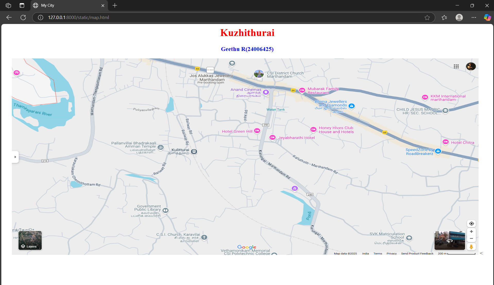
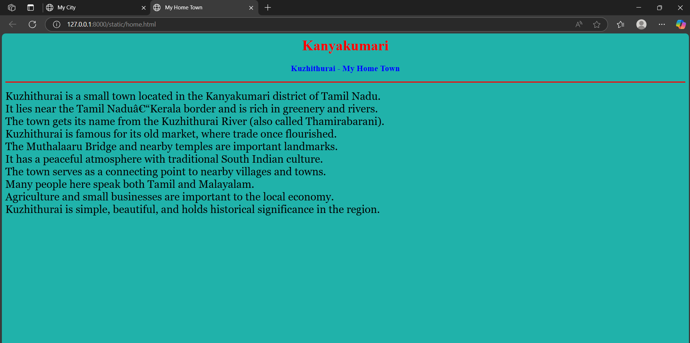
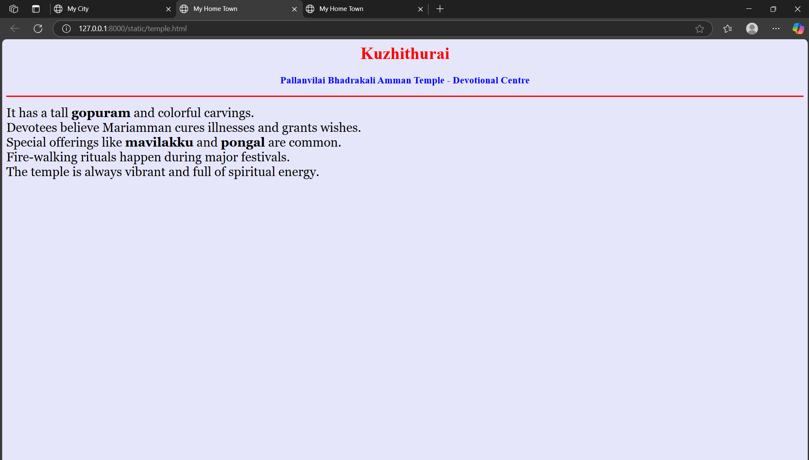

# Ex04 Places Around Me
## Name: GEETHU R
## Register No. :212224040089
## Date: 24-04-2025

## AIM
To develop a website to display details about the places around my house.

## DESIGN STEPS

### STEP 1
Create a Django admin interface.

### STEP 2
Download your city map from Google.

### STEP 3
Using ```<map>``` tag name the map.

### STEP 4
Create clickable regions in the image using ```<area>``` tag.

### STEP 5
Write HTML programs for all the regions identified.

### STEP 6
Execute the programs and publish them.

## CODE
~~~
map.html
<html>
<head>
<title>My City</title>
</head>
<body>
<h1 align="center">
<font color="red"><b>Kanyakumari</b></font>
</h1>
<h3 align="center">
<font color="blue"><b>Geethu R(24006425)</b></font>
</h3>
<center>

<map name="MyCity">
<<area target="_blank" alt="Home" title="Home" href="home.html" coords="495,111,122" shape="circle">
<area target="_blank" alt="Temple" title="Temple" href="temple.html" coords="385,391,634,492" shape="rect">
</map>
</center>
</body>
</html>

home.html
<html>
<head>
<title>My Home Town</title>
</head>
<body bgcolor="lightseagreen">
<h1 align="center">
<font color="red"><b>Kanyakumari</b></font>
</h1>
<h3 align="center">
<font color="blue"><b>Kuzhithurai - My Home Town</b></font>
</h3>
<hr size="3" color="red">
<p align="justify">
<font face="Georgia" size="5">
Kuzhithurai is a small town located in the Kanyakumari district of Tamil Nadu.<br>
It lies near the Tamil Nadu–Kerala border and is rich in greenery and rivers.<br>
The town gets its name from the Kuzhithurai River (also called Thamirabarani).<br>
Kuzhithurai is famous for its old market, where trade once flourished.<br>
The Muthalaaru Bridge and nearby temples are important landmarks.<br>
It has a peaceful atmosphere with traditional South Indian culture.<br>
The town serves as a connecting point to nearby villages and towns.<br>
Many people here speak both Tamil and Malayalam.<br>
Agriculture and small businesses are important to the local economy.<br>
Kuzhithurai is simple, beautiful, and holds historical significance in the region.
</font>
</p>
</body>
</html>


temple.html
<html>
<head>
<title>My Home Town</title>
</head>
<body bgcolor="lavender">
<h1 align="center">
<font color="red"><b>Kuzhithurai</b></font>
</h1>
<h3 align="center">
<font color="blue"><b>Pallanvilai Bhadrakali Amman Temple - Devotional Centre</b></font>
</h3>
<hr size="3" color="red">
<p align="justify">
<font face="Georgia" size="5">
It has a tall <b>gopuram</b> and colorful carvings.<br>
Devotees believe Mariamman cures illnesses and grants wishes.<br>
Special offerings like <b>mavilakku</b> and <b>pongal</b> are common.<br>
Fire-walking rituals happen during major festivals.<br>
The temple is always vibrant and full of spiritual energy.
</font>
</p>
</body>
</html>

~~~

## OUTPUT





## RESULT
The program for implementing image maps using HTML is executed successfully.
